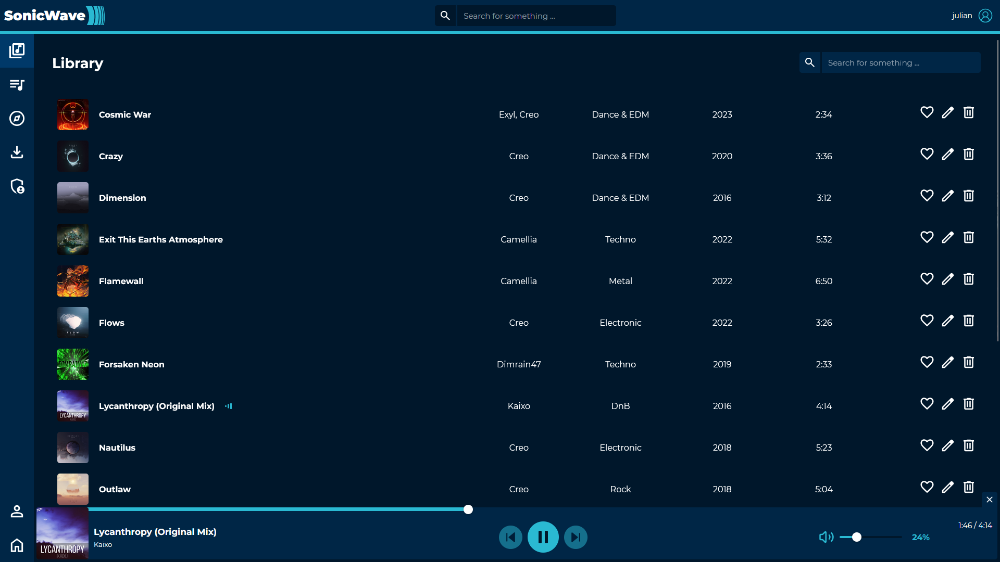
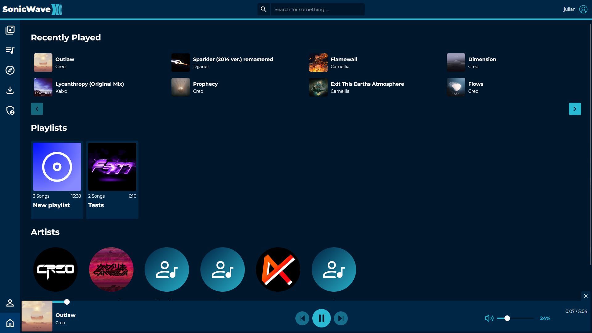

  

---

  SonicWave is self hosted music streaming service with song download capibility  

# Features
## Songs
  - Download songs using [yt-dlp](https://github.com/yt-dlp/yt-dlp) and save them per account
  - Browse songs in the internet
  - Stream songs (m4a)
  - Edit song metadata
  - Delete songs

## Playlists
  - Create playlists
  - Edit playlists
  - Delete playlists

## Artists
  - Automatically get added with songs
  - Edit artists

## Users
  - Register new users
  - Register requests instead of unconditional registration
  - User managment
  - User roles (owner, admin, user)
  - Change password

## Other
  - Change the site colors in the settings
  - Global search in the top navbar
  - Home page with recently played songs, playlists and artists

# Screenshots

